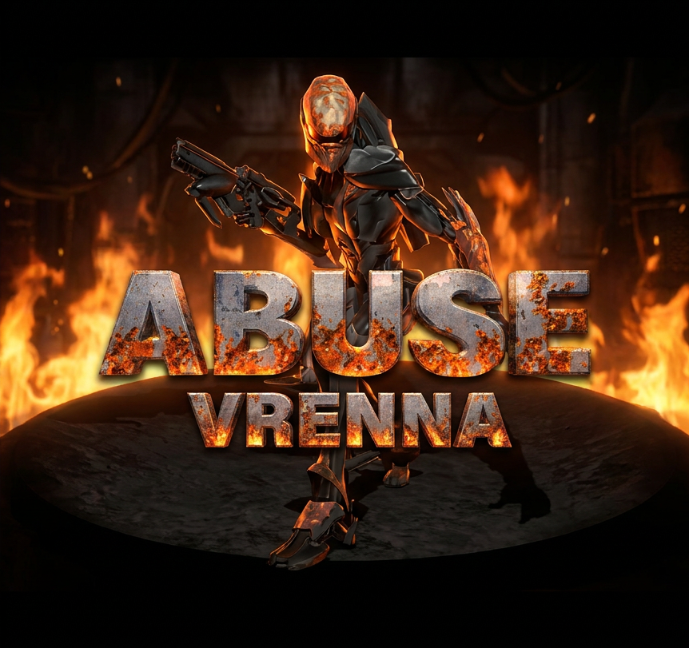

# Abuse: Vrenna



A modern port of Abuse (1995), named for Nick Vrenna, the man you play.


## The game

Abuse is a run-and-gun side-scroller, released as shareware by Crack dot Com
in 1995 and published a year later by Electronic Arts. It is remembered for
one idea: **your hands do different jobs.** The keyboard runs and jumps, the
mouse aims, and the two are completely independent. You can sprint left while
firing up and to the right, which every twin-stick shooter since has taken for
granted and almost nothing in 1995 could do.

The rest is a dark, deliberate game. Enemies come in swarms and kill quickly,
ammunition runs out, and the levels are built around switches, keys and
hazards as much as around shooting. It ships with the editor the developers
used, and the whole game is scripted in a Lisp dialect that loads at startup.

Two years after release Crack dot Com published the source code, and the
shareware data, sound effects aside, entered the public domain. That is why
the game is still alive, and why this port can exist at all.

## The story

Nick Vrenna is in a prison he does not deserve, where the staff run medical
experiments on the inmates. One of those experiments is a substance the
project calls **Abuse**.

A riot breaks out. In the confusion the experiment escapes containment, and
Abuse takes the prison: inmates and guards alike turn into something else.
Nick, alone, is immune. He learns the contagion is about to reach the water
supply and the world outside, arms himself with whatever the facility left
lying around, and goes down into the complex to stop it before he gets out.

## This port

SDL3, a fixed timestep, full gamepad support, a UI that stays sharp at any
window size, and translations. Everything new is optional, and the 1995 game
is still in there untouched.

## Two modes

**Original** plays the 1995 game with its own data, audio and rules, untouched.
It is the reference the tests compare against, and it does not change.

**Remastered** is where everything new goes. Nothing it adds is compulsory: the
classic preset is always there.

## What this fork adds

- **SDL3**, with scale modes, filtering, vsync and an FPS limit
- **A fixed 15 Hz timestep**, so a fast machine and a slow one run the same
  simulation
- **Gamepad**: several bindings per action, aiming on the right stick, optional
  aim assist, rumble, and button labels that match what your controller prints
- **A UI layer at native resolution**, composited over the scaled game, so its
  text is sharp at 1080p instead of being magnified along with the pixels
- **A start menu in words**, in your language, navigable with a d-pad; the
  strip of icons is one line of config away
- **An optional new HUD** (`hud=modern`) drawn at native resolution, with a
  health bar that shows the hit you just took
- **Widescreen** (`aspect=16:9`, and 16:10 and 21:9): a wider picture shows
  more of the room and changes nothing about the fight, because what wakes
  up in a level is a 4:3 region around the player whatever the window does
- **Optional RGB lighting**, the 1995 curve without the palette snap that
  bands every dark corner, and **CRT scanlines** to go with it
- **A GPU presentation path** (`renderer=gpu`), which adds Scale2x and a
  bloom around what is already bright. The classic path stays, and it is
  what the reference frames are taken through
- **Light that moves** (`dynlight`): a shot lights the corridor it crosses
  and an explosion lights the room, each in its own colour, from a table in
  `data/dynlight.txt`. The 1995 game had this written and commented out for
  being too slow on the machines of the day
- **Particles**: sparks off a hit, casings off a shot
- **Smooth movement** between logical ticks, which is there and is off: the
  art is animated at the tick rate, so the character skates. Kept because the
  camera half of it is worth revisiting
- **Reduce motion** (`reducemotion=on`): one switch over every effect that
  moves the picture by itself, which leaves the individual settings alone so
  they come back when it is turned off
- **English, French, German and Brazilian Portuguese**, chosen on first run
- **Deterministic replay testing**: a state hash, frame snapshots, and a
  snapshot of what actually reached the window

| | |
|---|---|
|  |  |
| First run asks for a language | The start menu, also reached with Esc |
|  |  |
| Options, reachable anywhere with F2 | Free aiming, the reason it still plays well |

## What you need

To **play**, on Linux: SDL3 and a 64-bit machine. That is the whole list. The
game draws into a 320x200 buffer and scales it on the GPU, so anything with a
working driver is enough, integrated graphics included; there is no shader
pipeline yet. It needs about 20 MB of disk and no network.

On Windows, take `abuse-windows` from the
[latest CI run](https://github.com/Esl1h/abuse-vrenna/actions): the executable, the
SDL DLLs, the game data and the fetcher for the original sound, in one folder.
Unpack and run, no compiler and no clone.

To **build**, CMake 3.21 or newer and a C++17 compiler. CPM fetches
SDL3_mixer, and SDL3 too when the system has no package for it.

```sh
# Arch, EndeavourOS. Everything is in the official repositories; no AUR.
sudo pacman -S --needed base-devel cmake ninja git sdl3 imagemagick ccache mold

# Fedora
sudo dnf install gcc-c++ cmake ninja-build git SDL3-devel ImageMagick ccache mold
```

`ninja` is the generator the presets use; `ccache` and `mold` only make the
build faster and the `dev` and `release` presets expect them. Without any of
the three, configure by hand and skip the presets:

```sh
cmake -S . -B build/rel -DCMAKE_BUILD_TYPE=Release -DCPM_USE_LOCAL_PACKAGES=ON
cmake --build build/rel -j"$(nproc)"
```

`imagemagick` is for the tests only: the snapshot suites compare frames with
`magick compare`, and skip themselves when it is absent.

## Playing

```sh
cmake --preset release && cmake --build --preset release
./build/release/src/abuse -datadir ./data -window
```

`-datadir ./data` is needed while running from the source tree. The window
opens at the largest whole multiple of 320x240 that fits your display.

| Key | |
|---|---|
| Arrows or WASD | Move |
| Mouse | Aim; left button fires, right is the special |
| Ctrl, Insert | Previous and next weapon |
| Esc | The menu |
| F2 | Options, where the new look is switched on row by row |
| F3 | Controls, to rebind anything |
| p | Pause |

On a gamepad: left stick and d-pad move, right stick aims, right trigger
fires, left trigger and B are the special, the shoulders change weapon, Y
opens the options and X the controls.

### Sound

**The Remastered mode has no sound yet.** The free data carries no effects and
no music, and assembling a free set is the next piece of work.

The Original mode plays as soon as the original data is installed. Pick it on
the menu, or from the command line:

```sh
./scripts/fetch-classic-data.sh
./build/release/src/abuse -datadir ./data --mode original
```

On Windows: `powershell -ExecutionPolicy Bypass -File scripts\fetch-classic-data.ps1`,
which does the same thing and puts the data where that platform looks for it.

The menu writes the choice down, so it survives the next launch.

Those files are not redistributable, which is why the script downloads them
rather than the repository carrying them.


## State of the work

Done: the SDL3 port, the build and test foundation, the data and licence
separation, the fixed timestep, gamepad support, the UI layer, the
translations, the start menu, the new HUD, smooth movement, widescreen,
the SDL_GPU presentation path with its filters, scanlines and bloom, RGB
lighting with light that shots and explosions cast in their own colour, an
override mechanism for higher resolution art, and the audio mix stage.

Every one of those is optional and off unless asked for. The classic preset
and the Original mode are compared against reference frames on every run,
and the replay hashes have to stay identical whatever is switched on: the
simulation is not allowed to notice any of it.

Open:

- **A free sound set.** The public domain Golgotha pack covers 19 of the 78
  events; the other 59 need a source, and the ones that need a human voice
  are the hard part. Until then the Remastered mode borrows the original
  audio when it is installed, and is otherwise silent
- **Human validation.** The game has been played on Linux and, once, on
  Windows 11. What nobody has judged yet by playing: widescreen, the new
  HUD, a physical gamepad, and how any of the visual additions feel
- **Art.** The higher resolution pack has the mechanism and no art; a second,
  more distant background layer for parallax needs tiles that do not exist
- Packaging. The manifests for Flatpak, the AUR and an AppImage are written
  and none of them has been built yet
- More replays that do something. One exists, recorded from a text script,
  and it is what a person's eyes caught before any test did

Inherited from upstream and still open: dead code removal, and replacing the
jFILE/bFILE layer with SDL's IO abstraction.

## Building

See [BUILDING.md](BUILDING.md). Presets: `dev`, `release`, `asan`, `headless`.

```sh
ctest --preset dev    # unit tests, replays, and both snapshot suites
```

### Tested on

Two machines, deliberately different, and both are checked before anything is
called done:

| | |
|---|---|
| **Fedora 44**, AMD Ryzen with a Radeon GPU, Wayland | Where the work happens and where the reference frames are recorded |
| **EndeavourOS**, Intel Core i7 with a GeForce RTX (hybrid), KDE on Wayland | Second opinion: different compiler (GCC 16), different SDL build, different GPU vendor |

The reference frames recorded on the first match the second byte for byte,
which is the point of having two. CI adds Ubuntu, Windows and macOS, and the
replay hashes agree across all of them: the simulation is deterministic
whatever it is running on.

Windows 11 on that same laptop has been played once, from a stick: first run,
configuration, the language screen, saving and the window size all behaved.
Widescreen, the new HUD, the gamepad and the original data are still unchecked
there.

[AGENTS.md](AGENTS.md) is the contract for anyone working on this, human or
agent, and [ARCHITECTURE.md](ARCHITECTURE.md) maps the engine, including the
parts that bite.

## Lineage

| | |
|---|---|
| [Crack dot Com](https://en.wikipedia.org/wiki/Abuse_(video_game)), 1995 | The original, later released into the public domain |
| [Abuse-SDL](http://abuse.zoy.org/), Sam Hocevar | The SDL port that kept it alive, and the source of the free data |
| [Xenoveritas/abuse](https://github.com/Xenoveritas/abuse) | The CMake and SDL3 fork this one starts from |
| This fork | Modernisation for current systems |

`abuse-tool` and the level editor (`-edit`) come along from upstream and still
work.

## Licence

Code is GPL-2.0, inherited. The game data that ships here is public domain,
with origin and licence recorded per file in
[data/MANIFEST.toml](data/MANIFEST.toml) and checked in CI. The original sound
and music are not redistributable and are never committed.

Thanks to Jonathan Clark, Dave Taylor and the rest of Crack dot Com for making
it and then giving it away, and to Sam Hocevar and Xenoveritas for the two
ports this one stands on.
