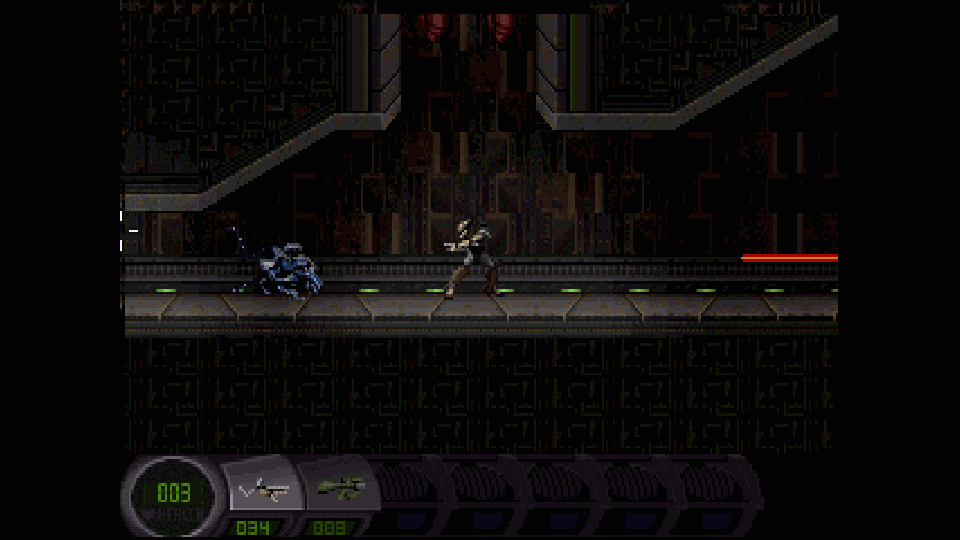
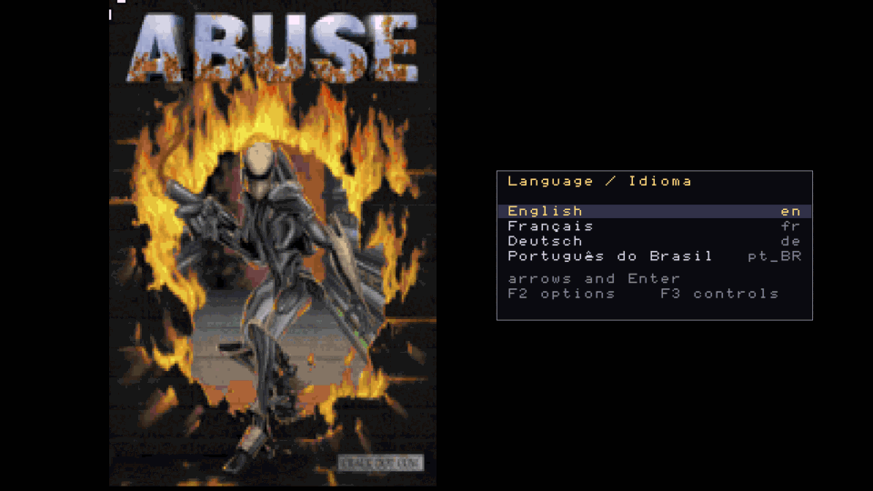
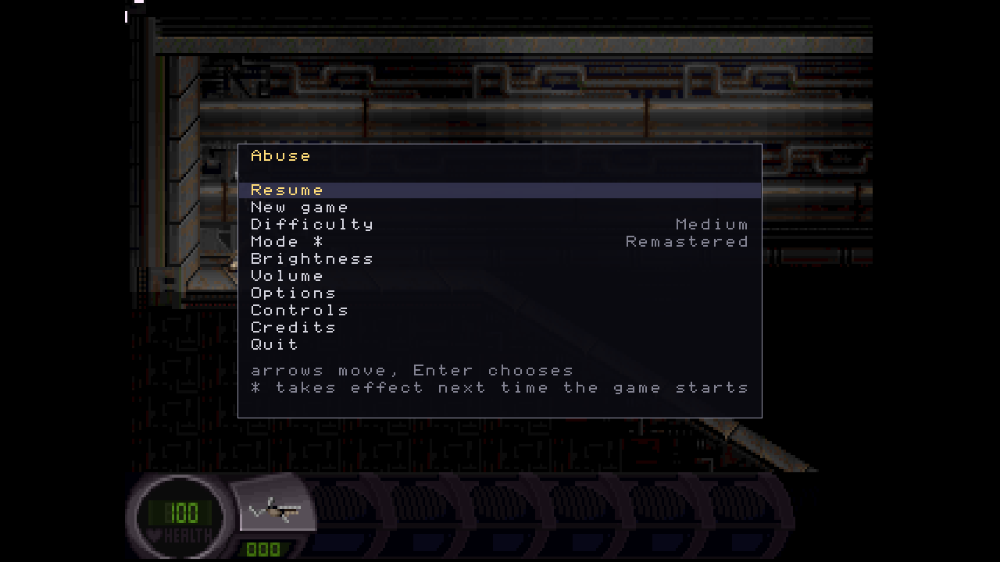
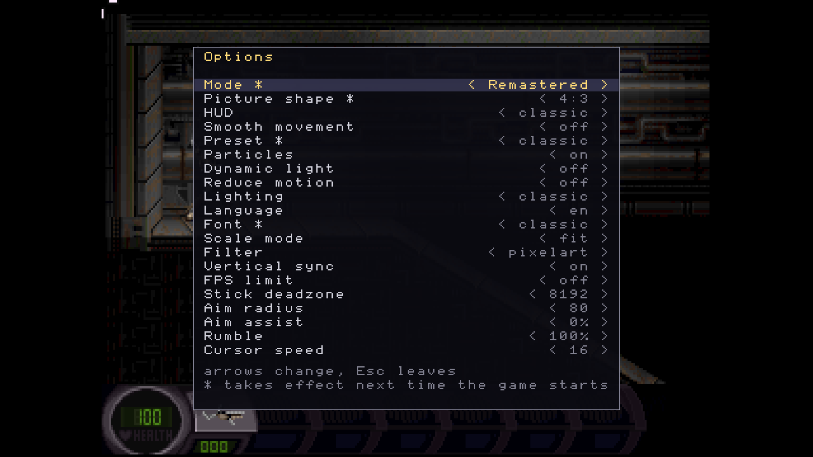
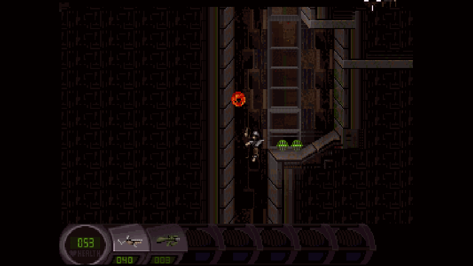
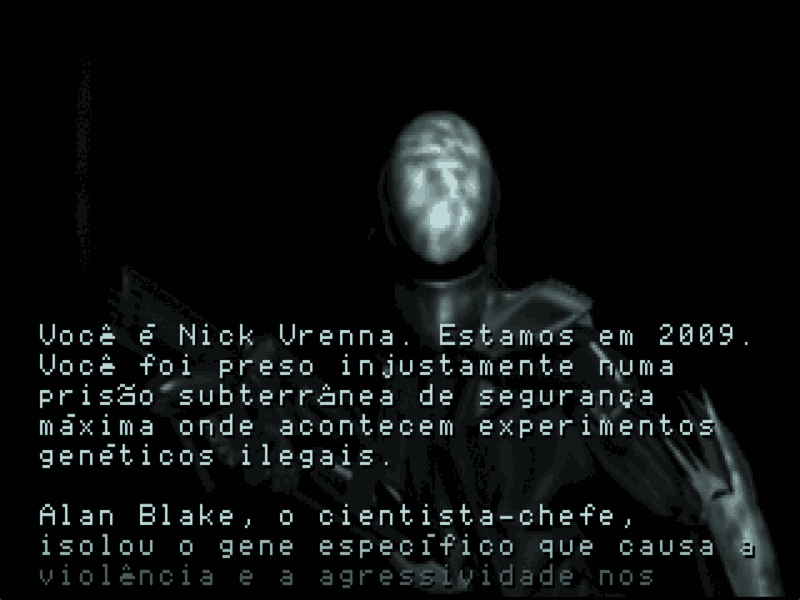

# Abuse

A 2D action platformer with free aiming, made by Crack dot Com in 1995 and
released into the public domain. You are Nick Vrenna, locked in an underground
prison where a gene that causes violence has escaped the lab. The mouse aims
independently of where you run, which in 1995 was new and still feels good.

This fork brings it to current systems: SDL3, a fixed timestep, full gamepad
support, a UI that stays sharp at any window size, and translations.



## Two modes

**Original** plays the 1995 game with its own data, audio and rules, untouched.
It is the reference the tests compare against, and it does not change.

**Remastered** is where everything new goes. Nothing it adds is compulsory: the
classic preset is always there.

## What this fork adds

- **SDL3**, with scale modes, filtering, vsync and an FPS limit
- **A fixed 15 Hz timestep**, so a fast machine and a slow one run the same
  simulation
- **Gamepad**: several bindings per action, aiming on the right stick, optional
  aim assist, rumble, and button labels that match what your controller prints
- **A UI layer at native resolution**, composited over the scaled game, so its
  text is sharp at 1080p instead of being magnified along with the pixels
- **A start menu in words**, in your language, navigable with a d-pad; the
  strip of icons is one line of config away
- **An optional new HUD** (`hud=modern`) drawn at native resolution, with a
  health bar that shows the hit you just took
- **Smooth movement**: the world still advances 15 times a second, but the
  drawing no longer does, so a 60 Hz display shows 60 positions
- **Optional RGB lighting**, the 1995 curve without the palette snap that
  bands every dark corner
- **English, French, German and Brazilian Portuguese**, chosen on first run
- **Deterministic replay testing**: a state hash, frame snapshots, and a
  snapshot of what actually reached the window

| | |
|---|---|
|  |  |
| First run asks for a language | The start menu, also reached with Esc |
|  |  |
| Options, reachable anywhere with F2 | Free aiming, the reason it still plays well |

## Playing

```sh
cmake --preset release && cmake --build --preset release
./build/release/src/abuse -datadir ./data -window
```

`-datadir ./data` is needed while running from the source tree. The window
opens at the largest whole multiple of 320x240 that fits your display.

| Key | |
|---|---|
| Arrows or WASD | Move |
| Mouse | Aim; left button fires, right is the special |
| Ctrl, Insert | Previous and next weapon |
| Esc | The menu |
| F2 → Lighting, HUD, Smooth movement | The new look, each on its own |
| F2 | Options |
| F3 | Controls, to rebind anything |
| p | Pause |

On a gamepad: left stick and d-pad move, right stick aims, right trigger
fires, left trigger and B are the special, the shoulders change weapon, Y
opens the options and X the controls.

### Sound

**The Remastered mode has no sound yet.** The free data carries no effects and
no music, and assembling a free set is the next piece of work.

The Original mode plays as soon as the original data is installed. Pick it on
the menu, or from the command line:

```sh
./scripts/fetch-classic-data.sh
./build/release/src/abuse -datadir ./data --mode original
```

The menu writes the choice down, so it survives the next launch.

Those files are not redistributable, which is why the script downloads them
rather than the repository carrying them.



## State of the work

Done: the SDL3 port, the build and test foundation, the data and licence
separation, the fixed timestep, gamepad support, the UI layer, the
translations, the start menu, the new HUD, smooth movement, RGB lighting,
and the audio mix stage.

Open:

- **A free sound set.** The public domain Golgotha pack covers 19 of the 78
  events; the other 59 need a source, and the ones that need a human voice
  are the hard part. Until then the Remastered mode is silent
- **Human validation** of everything above: none of it has been played yet,
  and Windows has never run this code at all
- GPU post-processing (CRT, bloom), coloured light, widescreen, an HD pack
- Packaging, which waits on a name for the project
- Closing out the test debt: the three replays are synthetic, 400 ticks with no
  input, so they exercise neither combat nor dynamic light

Inherited from upstream and still open: dead code removal, and replacing the
jFILE/bFILE layer with SDL's IO abstraction.

## Building

See [BUILDING.md](BUILDING.md). In short, CMake 3.21 or newer, a C++17
compiler, and CPM fetches SDL3 and SDL3_mixer. Presets: `dev`, `release`,
`asan`, `headless`.

```sh
ctest --preset dev    # unit tests, replays, and both snapshot suites
```

[AGENTS.md](AGENTS.md) is the contract for anyone working on this, human or
agent, and [ARCHITECTURE.md](ARCHITECTURE.md) maps the engine, including the
parts that bite.

## Lineage

| | |
|---|---|
| [Crack dot Com](https://en.wikipedia.org/wiki/Abuse_(video_game)), 1995 | The original, later released into the public domain |
| [Abuse-SDL](http://abuse.zoy.org/), Sam Hocevar | The SDL port that kept it alive, and the source of the free data |
| [Xenoveritas/abuse](https://github.com/Xenoveritas/abuse) | The CMake and SDL3 fork this one starts from |
| This fork | Modernisation for current systems |

`abuse-tool` and the level editor (`-edit`) come along from upstream and still
work.

## Licence

Code is GPL-2.0, inherited. The game data that ships here is public domain,
with origin and licence recorded per file in
[data/MANIFEST.toml](data/MANIFEST.toml) and checked in CI. The original sound
and music are not redistributable and are never committed.

Thanks to Jonathan Clark, Dave Taylor and the rest of Crack dot Com for making
it and then giving it away, and to Sam Hocevar and Xenoveritas for the two
ports this one stands on.
